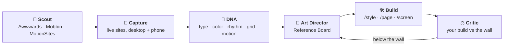

<p align="center">
  
</p>

<h3 align="center">A senior design studio, installed in Claude Code.</h3>

<p align="center">
  Your AI writes code that works and looks like every other AI app.<br />
  Sumi studies this week's award-winning sites, pulls them apart, builds against them,<br />
  and won't call your work finished until it holds up next to them.
</p>

<p align="center">
  
  
  
  
  
</p>

<p align="center">
  <a href="#install-in-30-seconds">Install</a> ·
  <a href="#new-in-420-sumi-looks-before-it-designs">The studio</a> ·
  <a href="#what-to-run-when">What to run</a> ·
  <a href="#recipes">Recipes</a> ·
  <a href="#how-it-works">How it works</a> ·
  <a href="#whats-verified-and-what-isnt">What's verified</a>
</p>

---

```
/sumi:inspo "fintech landing, dark, editorial"
```

That one line pulls current Awwwards Site of the Day winners and their jury scores. It opens the real sites in Chrome, scrolls them the way a person would, measures their type scale, palette, rhythm, grid and motion, and turns it all into a direction your build is graded against.

**That's the difference.** Other AI design help describes good design from memory. Sumi goes and looks.

---

## Install in 30 seconds

```
/plugin marketplace add phazurlabs/sumi
/plugin install sumi@sumi-marketplace
```

Then type one thing:

```
/sumi:start
```

It asks what you're working on in plain language, picks the right process, and starts. You never need to know what any of the 45 skills are called.

---

## New in 4.2.0: Sumi looks before it designs

A studio doesn't design a fintech landing page from recollection. It puts ten current winners on the wall, argues about what to steal, builds, then pins the build next to the wall and asks whether it belongs there.

Sumi now runs that loop, with a four-person team.



| Member | Job |
|---|---|
| **`scout`** | Pulls real, current references: Awwwards winners with jury scores and live URLs, Mobbin screens and flows, MotionSites motion recipes. Never from memory. |
| **`art-director`** | Takes **one** signature trait per reference, never a whole layout, and writes the direction as values a builder can type. |
| **`ux-architect`** | Designs flows from how real shipped apps do them: step count, where value lands, every state. |
| **`critic`** | Captures your build the same way it captured the references, and scores both side by side. |

### What it actually sees

These are real captures from two recent Sites of the Day, measured from the live pages:

```
✓ meer-mohsin   SOTD · 7.26   dark · display 192px · Lenis smooth scroll · Three.js / WebGL
✓ realevate     SOTD · 7.22   light · GSAP + ScrollTrigger · 12-column grid
```

For every reference you keep, `dna.json` records:

| Signal | Why it matters |
|---|---|
| Display vs body size, tracking, leading | The type contrast that separates editorial from template |
| Palette by *painted area*, not declared CSS | What's actually on screen, and how many accents it really uses |
| Section padding and heights | Rhythm, and whether there's a pinned, scroll-driven chapter |
| Grid columns, container width, radii | The underlying structure |
| House easing, tempo, motion stack | GSAP, Lenis, Three.js, WebGL, Framer, Webflow, and more |

Screenshots scroll with **real wheel input**. Smooth-scroll libraries ignore scripted scrolling, and naive capture tools end up with five pictures of the hero.

### The Reference Board

The team hands the builders `.sumi/refs/board.json` and a readable `board.md`:

```
References   5 kept, one trait each, with the award and the evidence
Norm         what every site in the category does (meet it, don't celebrate it)
Direction    display 144px / -0.035em / 0.9 · one accent · 144px section rhythm · 12 cols
Avoid        the category clichés that make a build look average
Rejected     the tempting traits that fail this brief, and why
```

From then on `/style`, `/page`, `/screen` and `/component` build against it. `/grade` and `/roast` score against it:

```
DQS 81/100 · clears the wall · board median jury score 7.25
| Dimension   | Build | Best ref     | Δ    |
| Typography  | 8.0   | 8.5 (meer)   | -0.5 |
| Motion      | 6.5   | 8.0 (meer)   | -1.5 |  → art-director: signature moment missing
```
<sub>The critic's output format. The numbers are illustrative.</sub>

**The one-trait rule** keeps it honest: the board takes one idea from each site, never two. If your build could be mistaken for any single reference, the critic flags **clone risk**, even when it scores well.

**What you need:** a local Chrome and `puppeteer-core` in your project (`npm i -D puppeteer-core`). For Mobbin, a Mobbin account and its MCP: `claude mcp add --transport http mobbin https://api.mobbin.com/mcp`. Awwwards and MotionSites need nothing extra.

---

## Three ways to use it

**1. Let it route you.** `/sumi:start` asks one question and begins. Best when the job spans more than one thing: a redesign, a launch, a new product.

**2. Run a command.** If you know what you want, go straight at it.

```
/sumi:inspo "portfolio for a 3D motion studio"
/sumi:audit src/checkout/
/sumi:component a date picker, React, with error and disabled states
/sumi:fix DashboardCard.tsx
```

**3. Just ask.** Skills activate on their own.

```
"Find me Awwwards sites like this for a real-estate launch"
"What does Fitts's Law say about button sizing?"
"Is this countdown timer a dark pattern?"
```

If you run a command with no target, it asks rather than inventing something to analyse. An audit of an imaginary interface reads as authoritative and is worthless.

---

## What to run when

| Your situation | Run this |
|---|---|
| You want it to look award-level, not "fine" | `/sumi:inspo` → `/sumi:style` → `/sumi:page` |
| Claude generated UI and it looks generic | `/sumi:fix` |
| Starting a new product or feature | `/sumi:brief` → `/sumi:inspo` → `/sumi:style` → `/sumi:screen` |
| Need to know if a design is any good | `/sumi:grade` for a score, `/sumi:roast` for a fast critique |
| Something's wrong but you can't name it | `/sumi:audit` |
| Designing a flow (onboarding, checkout, paywall) | `/sumi:inspo` with the flow → `/sumi:wireframe` → `/sumi:screen` |
| Accessibility review before shipping | `/sumi:a11y` |
| Building one component properly | `/sumi:component` |
| Setting up a design system | `/sumi:tokens` |
| Turning a Figma file into code | `/sumi:figma` |
| Checking an AI feature is trustworthy | `/sumi:ai-audit` |
| About to launch | `/sumi:preflight` |
| Lost | `/sumi:next` |

---

## Recipes

Each command writes its decisions to `.sumi/`, so later commands inherit them.

**The studio track: award-level, grounded in real work.**

```
/sumi:brief                  →  who it's for, the ONE action that matters
/sumi:inspo                  →  live winners → you pick 3-5 → captured DNA → Reference Board
/sumi:style                  →  the board becomes a full token system
/sumi:page landing           →  built against the board, every section tied to a trait
/sumi:grade                  →  critic scores it next to the references; fixes go back up the chain
```

**Fix AI-generated UI**, the most common job.

```
/sumi:fix Card.tsx          →  detects slop, rewrites it, cites the principle for each fix
/sumi:before-after          →  side-by-side proof of what changed
/sumi:grade                 →  Design Quality Score, 0-100
```

**Build a screen from nothing.**

```
/sumi:brief                 →  persona, constraints, success criteria
/sumi:style fintech         →  palette, type, spacing, motion, saved to .sumi/
/sumi:wireframe checkout    →  structure before pixels
/sumi:screen checkout       →  production code, every state
/sumi:a11y                  →  WCAG 2.2 pass with corrected code
```

**Audit something that exists.**

```
/sumi:audit src/            →  heuristics, cognitive load, flow, ethics, AI-slop
/sumi:remix                 →  evidence-based redesign of the weak areas
/sumi:qa                    →  does the build match the spec
```

**Stand up a design system.**

```
/sumi:tokens                →  W3C DTCG tokens: CSS, Tailwind, Style Dictionary
/sumi:dark                  →  dark mode derived from the light palette
/sumi:component Button      →  reference implementation, all states
/sumi:figma                 →  keep design and code in sync
```

---

## Design memory

Sumi remembers decisions across commands in a `.sumi/` directory at your project root. Decide once, and everything downstream inherits it. `/sumi:screen` uses *your* palette, and `/sumi:fix` corrects toward *your* system.

| File | Written by | Holds |
|---|---|---|
| `refs/` | `/inspo` | references, captures, DNA, and the Reference Board |
| `style.json` | `/style`, `/palette`, `/type`, `/tokens`, `/dark` | tokens, tone, reference apps |
| `brief.json` | `/brief` | persona, constraints, success criteria |
| `map.json` | `/map` | sitemap and screen inventory |
| `vision.json` | `/grade` | score and designer-DNA match |
| `decisions.log` | any command | append-only record of what changed and why |

Commit `.sumi/` to share the design direction with your team (add `.sumi/refs/**/*.jpg` to `.gitignore`, since captures of other people's sites are study material, not assets). Delete the directory to start fresh.

---

## The 38 commands

New here? Run `/sumi:start`. For the full map with starter recipes, run `/sumi:sumi`.

**MAKE (20)**: design and build

`/fix` `/style` `/palette` `/type` `/layout` `/wireframe` `/screen` `/component` `/page` `/tokens` `/form` `/nav` `/animate` `/icon` `/dark` `/responsive` `/onboard` `/generate` `/remix` `/figma`

**REVIEW (7)**: evaluate and improve

`/audit` `/roast` `/grade` `/qa` `/a11y` `/before-after` `/ai-audit`

**PLAN (7)**: research, references and strategy

`/brief` `/inspo` `/research` `/benchmark` `/map` `/measure` `/preflight`

**UTILITY (4)**

`/start` `/sumi` `/next` `/status`

The five that do the most work:

| Command | What it does |
|---|---|
| `/inspo` | Live references from Awwwards, Mobbin and MotionSites, captured and measured into a Reference Board that everything downstream builds and grades against. |
| `/fix` | Anti-slop engine. Takes UI that works but looks machine-made and rebuilds the design layer (typography, colour, spacing, states, accessibility) without touching your logic. |
| `/audit` | Five lenses in one pass: heuristics with severity ratings, cognitive load, flow, dark patterns, and AI-slop detection. Ends with a scored roadmap. |
| `/grade` | Design Quality Score 0-100 across ten dimensions. With a board present, scored side by side with real award winners. Honest: most AI-generated UI scores 30-50. |
| `/style` | Sector-aware visual direction (fintech reads differently from healthcare). Writes to `.sumi/` so everything downstream inherits it. |

---

## How it works

### Progressive disclosure

Sumi is large. It stays cheap by loading in three tiers:

| Tier | Loads | Cost |
|---|---|---|
| Skill descriptions | always | ~4,600 tokens |
| A skill's `SKILL.md` | when that skill triggers | ~1,500–4,000 tokens |
| Its `references/` | only when the skill points at one and it's needed | on demand |

So asking about button sizing loads the cognitive psychology skill, not the other 44. Asking for a React modal loads the component cookbook, not the Figma pipeline.

This is why v4.1.0 moved 125,000 tokens out of the always-loaded tier: a `/style` → `/screen` → `/fix` session went from 133,000 tokens to 70,000, which is the difference between two-thirds of your context window and a third of it.

### Scripts do the looking, skills do the judging

The reference engine keeps the testable parts in code and the taste in markdown:

- `scripts/awwwards.mjs` reads public Awwwards listings on demand. It is capped at 24 sites, pauses between requests, and caches results in `.sumi/refs/`.
- `scripts/capture.mjs` runs one headless Chrome pass over every kept site and writes screenshots plus `dna.json`. It uses your local Chrome and needs no new dependency in Sumi.
- `reference-intelligence` holds the rules the team works by: source routing, the one-trait rule, how to read the DNA, and how the critic compares.

### The orchestrator

Broad requests go to `sumi-orchestrator`, which picks one of twelve pipelines and runs its stages in order.

| You want to… | Pipeline |
|---|---|
| Find what's wrong with something that exists | Evaluate |
| Fix AI-generated UI that runs but looks wrong | Fix |
| Design something that doesn't exist yet | Create (now with sourced references) |
| Build or ship an actual component | Implement |
| Compose a whole page | Compose (now with sourced references) |
| Generate design assets with AI | Generate |
| Start or scale a design system | Systematize |
| Move a design into code | Handoff |
| Understand why people aren't finishing | Convert |
| Ship to new countries or languages | Localize |
| Design an AI or agent feature | AI Surface |
| Know whether any of it worked | Measure |

Every stage has a **gate** it must clear before the next begins. Evaluate won't advance while findings lack a severity rating, because unrated findings are opinions, and opinions don't survive a prioritisation meeting. Implement won't advance until every state is rendered and keyboard-navigable. You find out at stage three, not at the end.

---

## The 45 skills

Skills activate automatically. You never call them directly.

**Routing**: `sumi-orchestrator`, `design-memory`

**References (new)**: `reference-intelligence`

**Foundations**: `nng-ux-heuristics`, `cognitive-psychology-ux`, `ux-research-methods`, `ux-metrics-measurement`, `ux-ethics-content-strategy`, `design-process-methods`

**Visual craft**: `ui-visual-design-system`, `visual-design-mastery`, `color-palette-library`, `typography-pairing-recipes`, `shadow-elevation-density`, `image-media-patterns`, `icon-illustration-systems`

**Patterns and composition**: `ui-pattern-intelligence`, `screen-flow-patterns`, `layout-block-intelligence`, `page-composition-engine`, `navigation-pattern-encyclopedia`, `form-design-encyclopedia`, `responsive-block-patterns`

**Systems and code**: `design-systems-architecture`, `design-token-presets`, `component-patterns-code`, `figma-design-tool-workflows`, `performance-states-patterns`

**Platform**: `mobile-ux-design`, `desktop-app-design`, `platform-visual-standards`, `ambient-calm-zero-ui`, `cross-cultural-i18n-ux`

**Experience and craft**: `interaction-motion-design`, `animation-recipe-library`, `micro-copy-intelligence`, `accessibility-inclusive-design`

**Strategy and outcomes**: `sector-style-intelligence`, `conversion-optimization-patterns`, `data-visualization-mastery`, `design-critique-case-studies`, `business-design-templates`

**AI**: `agentic-ai-generative-ux`, `ai-spatial-voice-ux`, `ai-design-generation`

---

## What's verified, and what isn't

Sumi makes empirical claims, so it keeps an auditable record of which ones hold up.

`AUDIT.md` lists every claim checked against a primary source, every one corrected, and every one still outstanding. v3.1.0 corrected six defects, including a dark-mode power figure that was wrong by two orders of magnitude and two statistics attributed to research that doesn't contain them.

**54 of 84 extracted claims are not yet triaged**, almost all in skills that arrived with the v4.0.0 merge. `conversion-optimization-patterns` is the highest-risk cluster: conversion statistics are the most-copied and least-sourced numbers in the industry. Use its patterns; don't quote its figures to a client until they're checked.

The reference engine follows the same rule: **a reference is something fetched, never something remembered.** If Mobbin isn't connected or a capture fails, Sumi says so and labels anything else "from memory, not sourced."

Two scripts keep this honest, both wired into CI:

- `scripts/validate-plugin.py` is the release gate. It checks manifest shape, frontmatter, kebab-case names, and any count stated in the README or manifests that disagrees with the actual tree.
- `scripts/check-corpus.py` is the knowledge graph. Every reference must be reachable from a skill, no file may silently grow, no retired command name may linger, and no `.sumi/` artifact may carry two schemas. Existing debt is frozen against a committed baseline; new debt is a hard error.

A green build proves the plumbing is sound. It doesn't prove the advice is good. That's judgment, and judgment doesn't fit in CI.

---

## Installation

**Prerequisites:** [Claude Code CLI](https://docs.anthropic.com/en/docs/claude-code), authenticated. The core plugin is markdown, zero config, and works offline. `/inspo` capture additionally uses a local Chrome and `puppeteer-core`.

### From the marketplace (recommended)

Inside a Claude Code session:

```
/plugin marketplace add phazurlabs/sumi
/plugin install sumi@sumi-marketplace
```

Scope is chosen at install: user (all your projects), project (shared with your team via `.claude/settings.json`), or local (personal, gitignored).

### For development

```bash
git clone https://github.com/phazurlabs/sumi.git
claude --plugin-dir ./sumi
```

Loads for that session only.

### Verify it worked

```
/sumi:start
```

If the command exists, you're installed. Commands appear namespaced as `/sumi:<name>`. Then try the studio:

```
/sumi:inspo "landing page for a design studio"
```

### Troubleshooting

| Problem | Fix |
|---|---|
| Commands don't appear | Restart Claude Code after installing |
| `/plugin` not recognised | Update Claude Code to the latest version |
| Skills never activate | Check `.claude-plugin/plugin.json` exists at the plugin root |
| `/inspo` says puppeteer-core not found | `npm i -D puppeteer-core` in your project, or set `SUMI_PUPPETEER_DIR` |
| `/inspo` says no Chrome found | Install Google Chrome, or set `SUMI_CHROME` to a Chromium binary |
| Mobbin results missing | `/mcp` → `mobbin` → authenticate (needs a Mobbin account) |
| Stuck on an old version | `version` in `plugin.json` is the cache key, so run `/plugin update sumi` |
| Uninstall | `/plugin uninstall sumi` |

---

## Architecture

```
sumi/
├── .claude-plugin/
│   ├── plugin.json                 name, version (the cache key), license
│   └── marketplace.json            marketplace listing
│
├── skills/                         45 skills, auto-invoked
│   ├── sumi-orchestrator/          the router: 12 pipelines, stages, gates
│   ├── reference-intelligence/     sourcing, DNA, board synthesis, comparison
│   └── <skill>/
│       ├── SKILL.md                loads in full whenever the skill triggers
│       └── references/             195 reference files; load only when pointed at
│
├── agents/                         scout, art-director, ux-architect, critic
├── commands/                       38 commands, user-invoked
├── scripts/
│   ├── awwwards.mjs                live Awwwards winners → scores, tags, URLs
│   ├── capture.mjs                 live sites → screenshots + design DNA
│   ├── validate-plugin.py          release gate: structure, frontmatter, counts
│   ├── check-corpus.py             knowledge graph and context budget
│   └── extract-claims.py           pulls empirical claims for citation audit
├── tests/
│   ├── baseline.json               committed ratchet baselines
│   └── routing-fixtures.yaml       does the right skill fire for a real request
├── AUDIT.md                        claims verified, corrected, outstanding
└── CHANGELOG.md
```

The split that matters: **`SKILL.md` loads in full every time its skill triggers; `references/` load only when a skill points at them.** That's why depth lives in `references/`, and why keeping skills thin is enforced rather than encouraged.

---

## Built on

| Thinker | Contribution |
|---|---|
| Don Norman | Affordances, emotional design, three levels of processing |
| Jakob Nielsen | Ten usability heuristics, evidence-based evaluation |
| Daniel Kahneman | Peak-End Rule, cognitive biases, System 1 and 2 |
| John Sweller | Cognitive Load Theory |
| Dieter Rams | "Less, but better" |
| Edward Tufte | Information density with clarity |
| Amber Case | Calm technology, peripheral attention |
| Luke Wroblewski | Mobile-first, form design |
| Liz Lerman | Critical Response Process for critique |

Standards and sources: W3C (WCAG 2.2, Design Tokens 2025.10, WAI-ARIA), Nielsen Norman Group, Baymard Institute, Apple HIG (iOS 26), Material Design 3 Expressive, and product teardowns of Stripe, Linear, Notion, Figma, Arc, Vercel and others. There are also post-mortems of Snapchat 2018, Windows 8, Digg v4, Sonos 2024 and Healthcare.gov, because failures teach faster.

References: the live jury picks on [Awwwards](https://www.awwwards.com), shipped app UI on [Mobbin](https://mobbin.com), and motion recipes from [MotionSites](https://motionsites.ai). Sumi links to and studies them. It doesn't redistribute their content.

---

## License

Apache-2.0. See `LICENSE`, `NOTICE`, and `TRADEMARKS.md`. Contributions require a CLA; see `CONTRIBUTING.md`.

<p align="center"><sub>Built by <a href="https://phazurlabs.com">Phazur Labs</a></sub></p>
