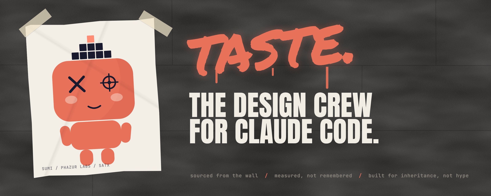
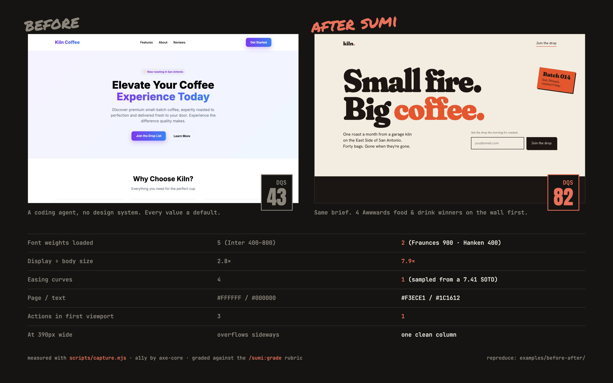
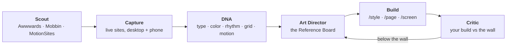

<p align="center">
  <picture>
    <source media="(prefers-color-scheme: dark)" srcset="assets/hero-dark.jpg" />
    <source media="(prefers-color-scheme: light)" srcset="assets/hero-light.jpg" />
    
  </picture>
</p>

<h3 align="center">The design crew for Claude Code. Taste, sourced from the wall.</h3>

<p align="center">
  <code>/plugin marketplace add phazurlabs/sumi</code> → <code>/plugin install sumi@sumi-marketplace</code> → <code>/sumi:start</code>
</p>

<p align="center">
  <a href="#the-tells">The Tells</a> ·
  <a href="#hit-the-wall">Install</a> ·
  <a href="#the-crew">The crew</a> ·
  <a href="#sample-dont-bite">Sample, don't bite</a> ·
  <a href="#why-sumi-exists">Why Sumi exists</a> ·
  <a href="#whats-verified-and-what-isnt">What's verified</a>
</p>

---

## Taste is a stack of decisions

**Every AI app ships the same defaults.** A default is a decision nobody made.

**Taste isn't a vibe.** It's a type scale, a palette, a rhythm, a curve. All of it can be measured.

**Go to the wall first.** Look at what won this week. Pull it apart before you draw a line.

**Sample, don't bite.** One idea per reference, flipped until it's yours.

**Two weights beat five. One curve beats twelve.**

**What goes out must be earned.**

---

## The Tells

You can spot an untuned AI build from across the street. These are the tags it leaves behind, and what Sumi does instead:

| The tell | What it looks like | What Sumi does |
|---|---|---|
| **Five weights of one font** | Inter 400, 500, 600, 700 and 800 all loaded | Two weights, two families, each with a job |
| **Flat type** | A 56px headline over 20px body copy (2.8×) | A display voice at 7-10× the body, tracked and leaded on purpose |
| **Pure #000 on #FFF** | Like looking at a blank receipt | A paper and an ink, sampled from the references |
| **A limp** | Four easing curves on one page | One house curve. A site with one curve has a gait |
| **Three doors** | "Get Started", "Join", and "Learn More" in the first screen | One action. Everything else points at it |
| **The purple gradient** | Violet into blue on the logo, the button and the headline | One accent, spent in one place |
| **Desktop only** | Cards run off the side of the phone | A grid that collapses and a rhythm for each breakpoint |

These aren't opinions. Sumi's capture script measures every one of them from the live page.

---

## Receipts

<p align="center">
  
</p>

Same brief both times: a landing page for Kiln, a small-batch roaster in San Antonio, where the one action is joining the drop list.

The **before** page is what a coding agent ships with no design system. For the **after** page, Sumi scouted Awwwards' food & drink winners first, kept four, and built against them. Every number above is measured, and axe-core ran on both pages.

**Run it yourself:** everything is in [`examples/before-after/`](examples/before-after/). The [grade sheet](examples/before-after/GRADE.md) shows the reasoning behind each score. The [Reference Board](examples/before-after/after/.sumi/refs/board.md) shows which trait came from which site, and what got rejected.

---

## Hit the wall

```
/plugin marketplace add phazurlabs/sumi
/plugin install sumi@sumi-marketplace
/sumi:start
```

`/sumi:start` asks what you're working on, in plain words, and picks the play. You never need to learn the names of the 45 skills.

Know what you want? Go straight at it:

```
/sumi:inspo "landing page for a coffee roaster, loud but warm"
/sumi:fix DashboardCard.tsx
/sumi:grade
```

---

## The crew

Hiring Sumi gets you a crew of four. They work the way a studio does: look first, argue about it, build, then pin the build next to the wall and ask whether it belongs there.



| | Role |
|---|---|
| **`scout`** | Pulls real, current references: Awwwards winners with jury scores and live URLs, Mobbin screens and flows, MotionSites motion recipes. Never from memory. |
| **`art-director`** | Takes one signature trait from each reference and writes the direction as values a builder can type. |
| **`ux-architect`** | Designs flows from how shipped apps really do them: step count, where the value lands, every state. |
| **`critic`** | Captures your build the same way it captured the references, and scores both side by side. |

Run it with `/sumi:inspo`. Every command after that builds against what the crew decided.

---

## Sample, don't bite

In the culture, biting means copying someone's style outright. Sampling means taking one piece and flipping it into something new. **The Reference Board runs on sampling.**

Here are the four references for Kiln, and the one thing taken from each:

| Reference | Award | What we sampled | What we left |
|---|---|---|---|
| ZEROZ | SOTD · 7.41 | Discipline: one accent, and one easing curve used on 79 of 85 transitions | The WebGL product scene and the 5,000px pinned chapters |
| Santioni Spirits | Honorable Mention | One lettered word carries the whole first screen | The age gate and the audio |
| Best Bean Best Cup | Honorable Mention | Warm paper surfaces against full-bleed roast-black bands | The full-width brand lockup |
| Partake Foods | Honorable Mention | Tilted stickers with hard offset shadows | Six font faces, four easings |

**The one-trait rule:** never take two things from the same site. If the build could be mistaken for any one reference, the critic flags **clone risk**, even when the score is high.

---

## Taste has knobs

For every reference it captures, Sumi records what the site actually paints, not what its CSS claims:

| Knob | What it tells you |
|---|---|
| **Type contrast** | Display size against body size. Editorial work runs 6× and up; product UI runs calm at 3-4× |
| **Tracking and leading** | Tight display tracking reads confident. Leading under 1.0 stacks headlines like a poster |
| **Accent count** | Saturated colors, weighted by painted area. One is discipline; three is a fight |
| **Rhythm** | Section padding and heights. A section far taller than the viewport means a pinned, scroll-driven chapter |
| **Grid and shape** | Column count, container width, corner radius. 0px reads editorial; pill buttons read friendly |
| **Motion stack** | The house easing, the tempo, and the libraries (GSAP, Lenis, Three.js, WebGL, Framer, Webflow) |

Screenshots scroll with real wheel input, because smooth-scroll sites ignore scripted scrolling. The capture also clicks past age gates, closes discount popups, and tells you when a site renders in canvas, where the DOM can't be measured.

**What you need:** a local Chrome and `puppeteer-core` in your project (`npm i -D puppeteer-core`). Mobbin also needs a Mobbin account and its MCP: `claude mcp add --transport http mobbin https://api.mobbin.com/mcp`.

---

## What to run when

| Your situation | Run |
|---|---|
| You want it award-level, not "fine" | `/sumi:inspo` → `/sumi:style` → `/sumi:page` |
| Claude built UI and it looks like every other AI app | `/sumi:fix` |
| Starting a product or feature | `/sumi:brief` → `/sumi:inspo` → `/sumi:style` → `/sumi:screen` |
| Is this any good? | `/sumi:grade` for a score, `/sumi:roast` for the fast version |
| Something's off and you can't name it | `/sumi:audit` |
| A flow: onboarding, checkout, paywall | `/sumi:inspo` with the flow → `/sumi:wireframe` → `/sumi:screen` |
| Accessibility before shipping | `/sumi:a11y` |
| One component, done right | `/sumi:component` |
| A design system | `/sumi:tokens` |
| Figma into code | `/sumi:figma` |
| An AI feature people can trust | `/sumi:ai-audit` |
| About to launch | `/sumi:preflight` |
| Lost | `/sumi:next` |

If you run a command with nothing to work on, it asks. An audit of an imaginary interface sounds authoritative and is worth nothing.

## Recipes

**The studio track.** Award-level, grounded in real work.

```
/sumi:brief            →  who it's for, the ONE action
/sumi:inspo            →  winners on the wall → you keep three to five → Reference Board
/sumi:style            →  the board becomes tokens
/sumi:page landing     →  built against the board, every section tied to a trait
/sumi:grade            →  the critic scores it next to the references
```

**Clean up AI UI.**

```
/sumi:fix Card.tsx     →  finds the tells, rewrites the design layer, cites a principle per fix
/sumi:before-after     →  the receipts
/sumi:grade            →  Design Quality Score, 0-100
```

**Audit what exists.**

```
/sumi:audit src/       →  heuristics, cognitive load, flow, ethics, AI tells
/sumi:remix            →  evidence-based redesign of the weak spots
/sumi:qa               →  does the build match the spec
```

---

## Blackbook

Every writer keeps a blackbook, and Sumi keeps one too: a `.sumi/` folder at your project root. Decide once, and every command after that inherits it.

| File | Written by | Holds |
|---|---|---|
| `refs/` | `/inspo` | references, captures, DNA, the Reference Board |
| `style.json` | `/style`, `/palette`, `/type`, `/tokens`, `/dark` | tokens, tone, reference apps |
| `brief.json` | `/brief` | persona, constraints, success criteria |
| `map.json` | `/map` | sitemap and screen inventory |
| `vision.json` | `/grade` | score and designer-DNA match |
| `decisions.log` | any command | what changed and why, append-only |

Commit `.sumi/` so the whole team inherits the direction. Keep `.sumi/refs/**/*.jpg` out of git: captures of other people's work are for study, not for shipping. Delete the folder to start clean.

---

## The 38 commands

**MAKE (20):** `/fix` `/style` `/palette` `/type` `/layout` `/wireframe` `/screen` `/component` `/page` `/tokens` `/form` `/nav` `/animate` `/icon` `/dark` `/responsive` `/onboard` `/generate` `/remix` `/figma`

**REVIEW (7):** `/audit` `/roast` `/grade` `/qa` `/a11y` `/before-after` `/ai-audit`

**PLAN (7):** `/brief` `/inspo` `/research` `/benchmark` `/map` `/measure` `/preflight`

**UTILITY (4):** `/start` `/sumi` `/next` `/status`

All of them are namespaced as `/sumi:<name>`. For the full map with recipes, run `/sumi:sumi`.

## The 45 skills

Skills fire on their own when a question calls for them.

**Routing:** `sumi-orchestrator`, `design-memory` ·
**References:** `reference-intelligence` ·
**Foundations:** `nng-ux-heuristics`, `cognitive-psychology-ux`, `ux-research-methods`, `ux-metrics-measurement`, `ux-ethics-content-strategy`, `design-process-methods` ·
**Visual craft:** `ui-visual-design-system`, `visual-design-mastery`, `color-palette-library`, `typography-pairing-recipes`, `shadow-elevation-density`, `image-media-patterns`, `icon-illustration-systems` ·
**Patterns and composition:** `ui-pattern-intelligence`, `screen-flow-patterns`, `layout-block-intelligence`, `page-composition-engine`, `navigation-pattern-encyclopedia`, `form-design-encyclopedia`, `responsive-block-patterns` ·
**Systems and code:** `design-systems-architecture`, `design-token-presets`, `component-patterns-code`, `figma-design-tool-workflows`, `performance-states-patterns` ·
**Platform:** `mobile-ux-design`, `desktop-app-design`, `platform-visual-standards`, `ambient-calm-zero-ui`, `cross-cultural-i18n-ux` ·
**Experience and craft:** `interaction-motion-design`, `animation-recipe-library`, `micro-copy-intelligence`, `accessibility-inclusive-design` ·
**Strategy and outcomes:** `sector-style-intelligence`, `conversion-optimization-patterns`, `data-visualization-mastery`, `design-critique-case-studies`, `business-design-templates` ·
**AI:** `agentic-ai-generative-ux`, `ai-spatial-voice-ux`, `ai-design-generation`

---

## Why Sumi exists

I was the kid with the blackbook: graffiti, MySpace pages, beats in the Napster days.

Where I grew up, everyone saw one way out, and it was sports. So when they told me to shut up and dribble, I listened. I buried the creative side and played baseball.

Then my elbow went, months before the season at Chico State. My career ended overnight, and I had to ask who I was without the game.

Art school answered. A teacher there was brutally honest about the work, and it changed my life. That voice followed me through media, advertising, fine art and UX, and on into product at Alibaba, Uproxx and CBS Interactive.

Now any AI can ship an app. Almost none of them can tell you if it's any good.

**Sumi is that teacher, installed.** It looks at the best work on the wall, then at yours, and tells you the truth.

<sub>Founder, Phazur Labs · Geekdom, San Antonio</sub>

---

## How it stays cheap

Sumi is big, but it loads in three layers:

| Layer | Loads | Cost |
|---|---|---|
| Skill descriptions | always | ~4,600 tokens |
| A skill's `SKILL.md` | when that skill fires | ~1,500–4,000 tokens |
| Its `references/` | only when the skill points at one | on demand |

Ask about button sizing and you load the cognitive psychology skill, not the other 44. Since v4.1.0, a `/style` → `/screen` → `/fix` session costs 70,000 tokens instead of 133,000.

The looking is done by code, and the judging by writing. `scripts/awwwards.mjs` reads public Awwwards listings on demand: a small, capped number of sites per run, with pauses between requests. `scripts/capture.mjs` makes one headless Chrome pass over the kept sites. The crew's rules live in `reference-intelligence`.

Broad requests go to `sumi-orchestrator`, which picks one of twelve pipelines, including Evaluate, Fix, Create, Compose, Systematize and Measure, and runs each stage behind a gate. You find out at stage three, not at the end.

---

## What's verified, and what isn't

Sumi makes claims, so it keeps receipts.

`AUDIT.md` lists every claim checked against a primary source, every correction, and everything still outstanding. v3.1.0 fixed six defects, including a dark-mode power figure that was off by two orders of magnitude.

**54 of 84 extracted claims are not yet triaged**, mostly in skills that arrived with the v4.0.0 merge. `conversion-optimization-patterns` carries the most risk. Use its patterns, but check its figures before you quote them to a client.

**A grade is a critique, not a verdict.** The measurements in the receipts can be reproduced; the category scores are judgment, and the grade sheet shows every reason. And a reference is something Sumi fetched, never something it remembered. If Mobbin isn't connected or a capture fails, Sumi says so.

Two scripts guard the plumbing in CI:
- `scripts/validate-plugin.py` checks manifests, frontmatter, names, and every count this README states.
- `scripts/check-corpus.py` checks that every reference is reachable, that no file silently grows, that no dead command name lingers, and that no `.sumi/` file has two schemas.

A green build proves the plumbing. It can't prove the taste. That part is on the crew.

---

## Install, properly

**You need** the [Claude Code CLI](https://docs.anthropic.com/en/docs/claude-code), authenticated. The core is markdown: zero config, and it works offline. `/inspo` capture adds a local Chrome and `puppeteer-core`.

```
/plugin marketplace add phazurlabs/sumi
/plugin install sumi@sumi-marketplace
```

Pick the scope when you install: user (all your projects), project (shared through `.claude/settings.json`), or local (yours, gitignored).

**To hack on it:** `git clone https://github.com/phazurlabs/sumi.git && claude --plugin-dir ./sumi`

| Problem | Fix |
|---|---|
| Commands don't appear | Restart Claude Code after installing |
| `/plugin` not recognised | Update Claude Code |
| `/inspo` can't find puppeteer-core | `npm i -D puppeteer-core`, or set `SUMI_PUPPETEER_DIR` |
| `/inspo` can't find Chrome | Install Chrome, or set `SUMI_CHROME` |
| No Mobbin results | `/mcp` → `mobbin` → authenticate |
| Stuck on an old version | `/plugin update sumi` (`version` in `plugin.json` is the cache key) |
| Uninstall | `/plugin uninstall sumi` |

## Architecture

```
sumi/
├── .claude-plugin/            plugin.json (version = cache key), marketplace.json
├── agents/                    scout, art-director, ux-architect, critic
├── commands/                  38 commands, user-invoked
├── skills/                    45 skills, auto-invoked
│   └── <skill>/
│       ├── SKILL.md           loads in full when the skill fires
│       └── references/        195 reference files, loaded only when pointed at
├── scripts/                   awwwards.mjs, capture.mjs, validate-plugin.py, check-corpus.py, extract-claims.py
├── examples/before-after/     the receipts: before, after, board, grade sheet
├── assets/                    art, plus the HTML it's rendered from (assets/src)
├── tests/                     ratchet baselines, routing fixtures
├── AUDIT.md                   claims verified, corrected, outstanding
└── CHANGELOG.md
```

## Standing on

Don Norman, Jakob Nielsen, Daniel Kahneman, John Sweller, Dieter Rams, Edward Tufte, Amber Case, Luke Wroblewski, and Liz Lerman's Critical Response Process. We also lean on W3C (WCAG 2.2, Design Tokens, WAI-ARIA), Nielsen Norman Group, Baymard, Apple HIG and Material 3 Expressive. The post-mortems of Windows 8, Digg v4 and Sonos 2024 are in there too, because failures teach faster.

The wall itself belongs to the jury picks on [Awwwards](https://www.awwwards.com), the shipped UI on [Mobbin](https://mobbin.com), and the recipes on [MotionSites](https://motionsites.ai). Sumi links to and studies them. It doesn't redistribute their work.

## License

Apache-2.0. See `LICENSE`, `NOTICE` and `TRADEMARKS.md`. Contributions need a CLA; see `CONTRIBUTING.md`.

<p align="center"><b>Built for inheritance, not hype.</b><br /><sub>Phazur Labs · San Antonio</sub></p>
